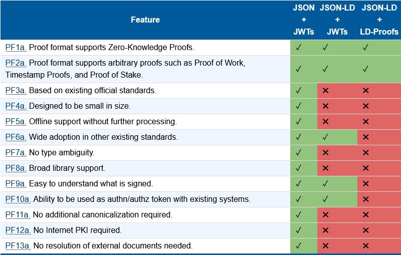

## Formas de firmar una VC

### Empleando signJWT() y ES256K
Esta función implementada en las librerías de Alastria permite firmar un JWT usando el algoritmo ES256K, algoritmo empleado en Bitcoin y Ethereum para firmar transacciones.
Esta firma es para validar la transacción empleando la clave privada del Issuer en la red de Ethereum en la que se esté trabajando. 


### Cada Blockchain tiene su algoritmo propio para firmar transacciones.
Como se especificó en el apartado anterior, tanto Bitcoin como Ethereum emplean el mismo Digital Signature Algorithm, siendo Elliptic Curve Digital Signature Algorithm , _ECDSA_.

Otras blockchains, como Cardano o Polkadot, emplean otro algoritmo, Edwards-curve Digital Signature Algorithm, _EdDSA_. 

De este modo, una transacción será devuelta por la EVM en caso de que la transacción no haya sido firmada con la clave privada respectiva

### Proofs a mayores para validar el contenido de una VC o una VP.
Dentro de una Verifiable Credential en el campo ***credentialSubject***, o de una Verifiable Presentation en el campo ***vp***, se pueden añadir tantos _claims_ como sean necesarios sobre el token. W3C permite el uso de cualquier tipo de claim del modelo de datos en JWT siempre y cuando su uso no esté desaconsejado. El uso del campo _proof_ no esta desaconsejado, luego puede añadirse como en el siguiente ejemplo:
```
"proof": {
    "type": "AnonCredDerivedCredentialv1",
    "primaryProof": "cg7wLNSi48K5qNyAVMwdYqVHSMv1Ur8i...Fg2ZvWF6zGvcSAsym2sgSk737",
    "nonRevocationProof": "mu6fg24MfJPU1HvSXsf3ybzKARib4WxG...RSce53M6UwQCxYshCuS3d2h"
    }

```
Dado que estos campos son libres, se permite el uso de cualquier tipo de verificación. Esto incluye según W3C, tanto firmas digitales como otro tipo de pruebas propias de la blockchain, como por ejemplo Proof-of-Work o Proof-of-Stake.
**En caso de usar JWT**, por motivos de compatibilidad, de usar una firma digital, esta debe representarse como JWS: _'The issuer MAY include both a JWS and a proof property. For backward compatibility reasons, the issuer MUST use JWS to represent proofs based on a digital signature'_, [W3C, Data Model, JWT encoding](https://www.w3.org/TR/vc-data-model/#jwt-encoding), párrafo 4.

Tras ello, el valor de ***alg*** de la cabecera del JWT se debe especificar al algoritmo empleado para realizar la firma digital. Alastria emplea ES256K, especificado en la propia librería y el necesariamente usado. 

### Uso de las librerías de Alastria

Dado que alastria-identity-lib incluye la _proof_ de **ES256K** en la creación de cada una de las VC y VP, la modificación que puede realizarse para hacer uso de otra _proof_, es el campo añadido en ***credentialSubject*** o ***vp*** anteriormente mencionados.

Con ello se realizaría una firma con la clave privada del Issuer en la red blockchain donde se cree la VC o VP. Otra proof se añadiría para futuras comprobaciones, la cual podría ser algún tipo de certificado o proof de la blockchain, que podrían usarse como pruebas a parte que no solo validen la vericidad de la transacción (como la firma JWS), sino algún otro tipo de atributo asociado a dichos certificados.

### Formato de las _proofs_
El modelo de datos de W3C no especifica ningún formato concreto para las pruebas.
Sin embargo, a la hora de desarrollar VCs, hay que tener en cuenta la compatibilidad de cada tipo de formato con cada tipo de prueba.

***En la segunda fila se incluye el uso de Timestamps.***




Como puede verse, el uso de JSON + JWTs permite cualquier tipo de proof, luego las incompatiblidades no serán un problema.

Una mejor descripción de cada compatibilidad puede encontrarse en https://w3c.github.io/vc-imp-guide/#proof-formats. En muchos de los casos, el motivo principal por el que no pueden usarse JSON Linked Data o Linked Data Proofs es debido a que todavía no existe una estandarización firme en torno a estos formatos, así como su necesidad de recursos online y su mayor complejidad.


## Uso de Zero-Knowledge Proofs

Para que el modelo de VCs sea completamente fiable, es necesario que las pruebas no revelen información innecesaria del Holder, minimizando los datos en todo momento.

Esta minimalización de los datos exige que los siguientes puntos sean tratados, lo cual se logra al usar Zero-Knowledge Proof tal y como se explica a continuación:

* **Divulgación completa. (Full Disclosure).** Para evitar el rastreo de un Holder y de sus acciones, la firma presentada no presenta la clave privada en su totalidad, sino un fragmento firmado que sirve como prueba. Así, al no revelar la clave privada, esta no puede usarse como un identificador único.
* **Divulgación selectiva. (Selective Disclosure).** De este modo un Holder no tiene por qué proporcionar toda la información contenida en una VC. Cada atributo es incorporado en la firma de la VC y por lo tanto puede verificarse individualmente del resto mostrando la VC.
* **Pruebas de predicados. (Predicate Proofes).** Estas pruebas refieren a demostraciones que pretenden corroborar una información sin saber el dato exacto, por ejemplo, si se es mayor de edad sin ver el valor concreto del año. Con Zero-Knowledge Proofs es posible para el Holder generar este tipo de pruebas a partir de una VC, revelando así solamente la veracidad o no del predicado, sin otorgar el valor concreto del dato.
* **Revocación. (Revocation).** Para evitar que observadores y monitores de la red pueda rastrear y correlacionar presentaciones de credenciales, el identificador de la VC se compara con aquellos en una lista de revocación. De este modo, el Issuer puede determinar si una credencial ha sido revocada sin ver el estado de la presentación.
* **Correlación. (Correlation).** Para evitar que un Verificador, un Issuer o un tercero espiando al red, sea capaz de vincular distintas interacciones a un único usuario, desanonimizando las transacciones, se hace uso de la minimalización de los datos. Esto implica mostrar únicamente los atributos esstrictamente necesarios para probar algo.

-----